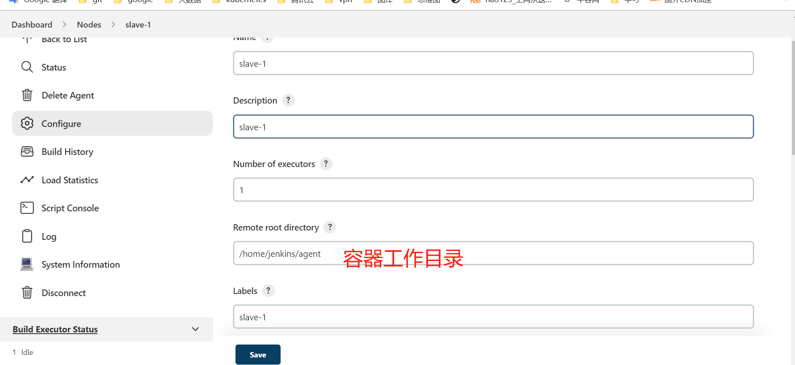
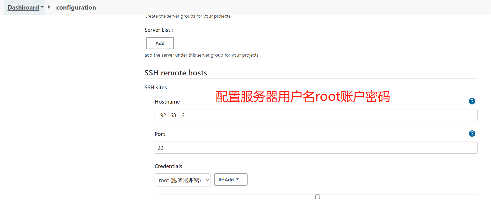
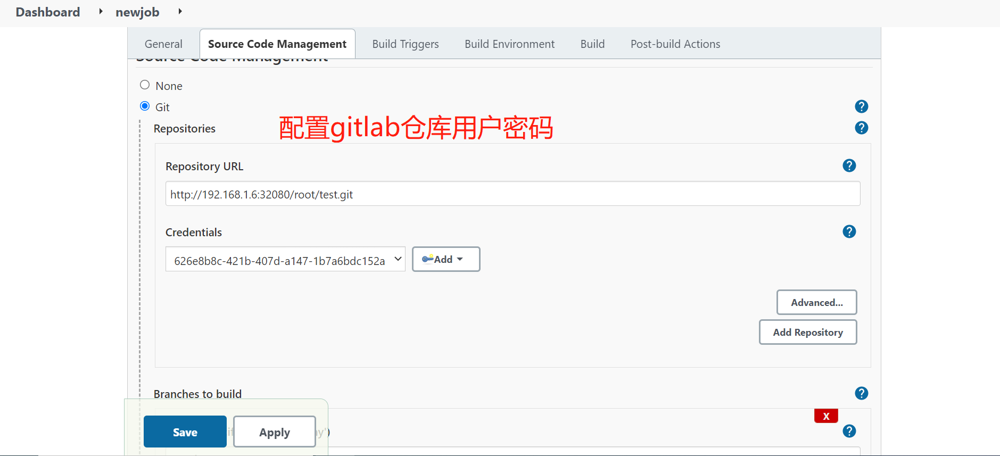
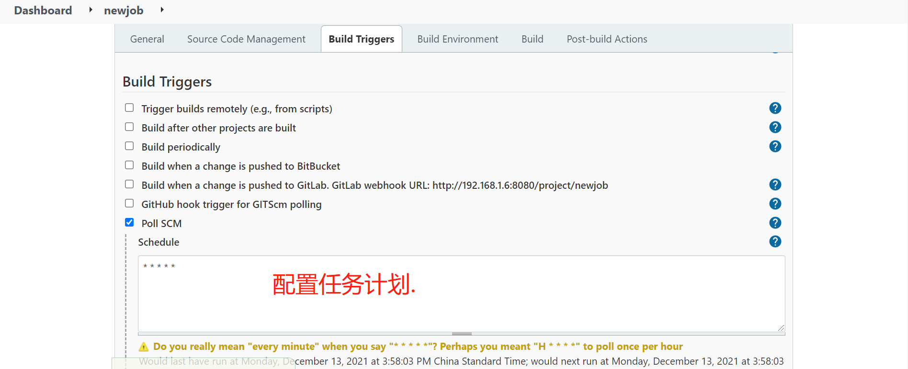
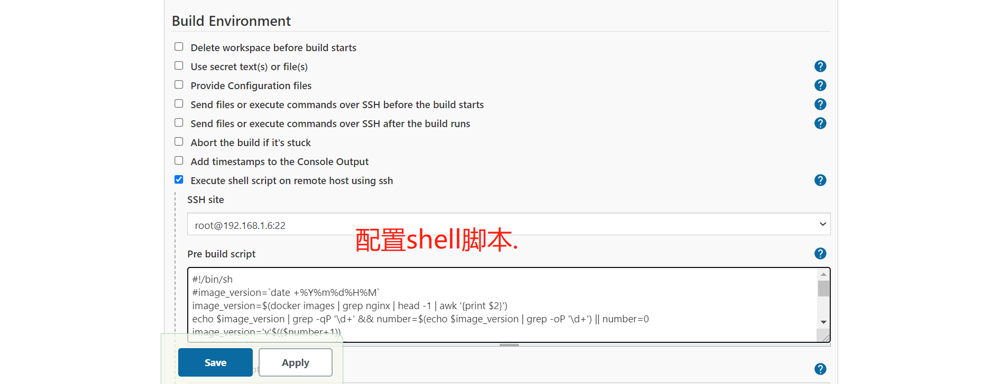

### 一、启动jenkins.

```javascript
echo 1 > /proc/sys/net/ipv4/ip_forward
#启动
docker run -itd \
  -u root \
  -p 8080:8080 \
  -p 50000:50000 \
  -v /data/jenkins:/var/jenkins_home \
  -v /var/run/docker.sock:/var/run/docker.sock \
  -v $(which docker):/usr/bin/docker \
  -v /usr/libexec/docker/:/usr/libexec/docker/ \
  -e JAVA_OPTS=-Duser.timezone=Asia/Shanghai \
  --name jenkins \
  --restart=always \
  jenkins/jenkins:lts


#jenkins slave部署,token为master部署好以后生成
docker run -itd \
  -u root \
  --restart=always \
  --name slave-1 \
  --init \
  -v /var/run/docker.sock:/var/run/docker.sock \
  -v $(which docker):/usr/bin/docker \
  -v /usr/libexec/docker/:/usr/libexec/docker/ \
  -e JAVA_OPTS=-Duser.timezone=Asia/Shanghai \
  -v /data/jenkins:/home/jenkins/agent \
  jenkins/inbound-agent:jdk8 \
  -url http://172.27.0.3:38080 \
  -workDir=/home/jenkins/agent \
  fce9ca7c44b6ff141adc6828606f2fd6ad6bfb527df855f369a431b931ab2aed \
  slave-1


#helm部署jenkins
helm repo add jenkins https://charts.jenkins.io
helm repo update
#打标签，slave只允许调度到这两个节点.
kubectl label node node2 cicd=jenkins
kubectl label node node3 cicd=jenkins

helm install jenkins \
  -n kube-system \
  --set controller.jenkinsUrl=jenkins.jenkins.svc.cluster.local:8080 \
  --set controller.admin.username=admin \
  --set controller.admin.password="Test@123" \
  --set controller.serviceType=LoadBalancer \
  --set persistence.storageClass=local-path \
  --set persistence.size=6Gi \
  --set agent.podName=slave \
  --set agent.nodeSelector."cicd"=jenkins \
  --set controller.javaOpts="-Duser.timezone=Asia/Shanghai" \
  --set controller.resources.requests.cpu="50m" \
  --set controller.resources.requests.memory="256Mi" \
  --set controller.resources.limits.cpu="2000m" \
  --set controller.resources.limits.memory="4096Mi" \
  --set agent.resources.requests.cpu="512m" \
  --set agent.resources.requests.memory="512Mi" \
  --set agent.resources.limits.cpu="1000m" \
  --set agent.resources.limits.memory="1024Mi" \
  jenkins/jenkins

#如果报错一般都是网络问题,下载插件下载不下来,可以先找一个可以上外网的服务器把plugins目录下载下来，然后拷贝到/data/local-path-provisioner/pvc-3f7133c4-0267-47c1-a6f3-df0d317fed29_jenkins_jenkins pvc挂载的目录下就可以解决,或者用下面的代理方法解决，准备一个代理地址.
kubectl logs -n jenkins jenkins-0 -c init -f


helm install jenkins \
  -n kube-system \ \
  --set controller.jenkinsUrl=jenkins.jenkins.svc.cluster.local:8080 \
  --set controller.admin.username=admin \
  --set controller.admin.password="Test@123" \
  --set controller.serviceType=LoadBalancer \
  --set controller.nodePort=30080 \
  --set persistence.storageClass=local-path \
  --set persistence.size=6Gi \
  --set agent.podName=slave \
  --set agent.nodeSelector."cicd"=jenkins \
  --set controller.javaOpts="-Duser.timezone=Asia/Shanghai -Dhttp.proxyHost=192.168.197.20 -Dhttp.proxyPort=7890 -Dhttps.proxyHost=192.168.197.20 -Dhttps.proxyPort=7890" \
  --set controller.resources.requests.cpu="50m" \
  --set controller.resources.requests.memory="256Mi" \
  --set controller.resources.limits.cpu="2000m" \
  --set controller.resources.limits.memory="4096Mi" \
  --set agent.resources.requests.cpu="512m" \
  --set agent.resources.requests.memory="512Mi" \
  --set agent.resources.limits.cpu="1000m" \
  --set agent.resources.limits.memory="1024Mi" \
  --set controller.initContainerEnv[0].name=http_proxy \
  --set controller.initContainerEnv[0].value="http://192.168.197.20:7890" \
  --set controller.initContainerEnv[1].name=https_proxy \
  --set controller.initContainerEnv[1].value="http://192.168.197.20:7890" \
  --set controller.initContainerEnv[2].name=no_proxy \
  --set controller.initContainerEnv[2].value="" \
  --set controller.initContainerEnv[3].name=JAVA_OPTS \
  --set controller.initContainerEnv[3].value="-Dhttps.proxyHost=192.168.197.20 -Dhttps.proxyPort=7890" \
  --set controller.containerEnv[0].name=http_proxy \
  --set controller.containerEnv[0].value="http://192.168.197.20:7890" \
  --set controller.containerEnv[1].name=https_proxy \
  --set controller.containerEnv[1].value="http://192.168.197.20:7890" \
  jenkins/jenkins
```



### 二、配置项目











```javascript
#!/bin/bash
image_version=`date +%Y%m%d%H%M`
cd /data/jenkins/workspace/newjob
docker build -t nginx:$image_version .
old=`kubectl get deploy/nginx -o yaml | grep -P '\- image'| awk '{print $3}'`
kubectl set image deployment/nginx nginx=nginx:$image_version
sleep 10
docker rmi $old
docker images
```

