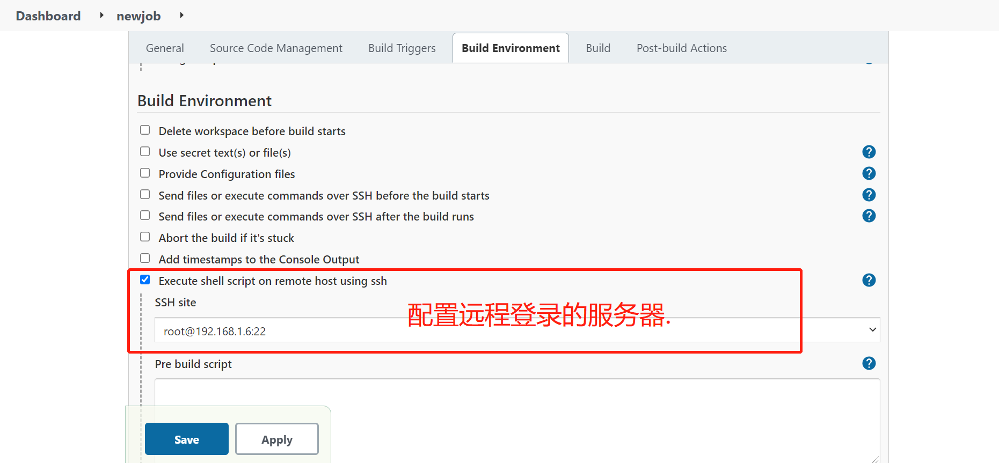
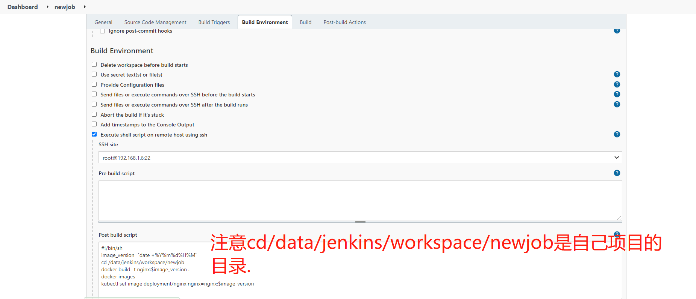

### 一、启动jenkins.

```javascript
echo 1 > /proc/sys/net/ipv4/ip_forward
mkdir /data/jenkins -p && chown -R 1000:1000 /data/jenkins
#启动
docker run --restart=always -p 8080:8080 -p 50000:50000 -d  -v /data/jenkins:/var/jenkins_home -e JAVA_OPTS=-Duser.timezone=Asia/Shanghai --name jenkins jenkins/jenkins:lts
```

### 二、配置项目





